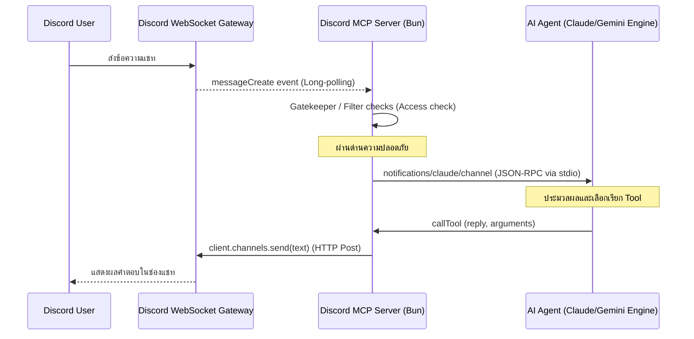

การขยายขีดความสามารถของ AI Agent จากการรันใน Local Terminal ไปสู่โปรแกรมแชทที่ทำงานร่วมกับทีม (Collaborative Environments) อย่าง Discord จำเป็นต้องมีชั้นการส่งสาร (Transport Layer) ที่มีประสิทธิภาพและปลอดภัย 

บทความนี้จะเจาะลึกสถาปัตยกรรมการพัฒนา **Discord Channel** ด้วยระบบ **Model Context Protocol (MCP)** โดยอ้างอิงและแกะรหัสจากซอร์สโค้ดทางการของ Anthropic Claude Plugins (`external_plugins/discord/server.ts`)

---

## 📡 1. สถาปัตยกรรมทางเทคนิค: สรุปภาพรวมการส่งสาร (Overview)

ในการสร้าง Discord Channel บอทจำเป็นต้องทำหน้าที่เป็น **"สะพานสองท่อ (Dual-Transport Bridge)"**:
1. **Discord Gateway Intent (Long-Polling)**: คอยฟัง Event ข้อความใหม่เข้าจาก Discord Client ด้วยโปรโตคอล WebSockets
2. **MCP Stdio Server (Local Interface)**: ดำเนินการแปลงข้อความเหล่านั้นให้อยู่ในสเปกของ MCP JSON-RPC 2.0 แล้วส่งต่อให้ AI



---

## 🔒 2. เจาะลึกโค้ดระบบความปลอดภัยด่านหน้า (The Gatekeeper & Pairing Code)

หนึ่งในความเสี่ยงสูงสุดของการนำ AI มาต่อกับ Discord คือการถูก **Spoofing (การปลอมแปลงตัวตน)** เพื่อสั่งงานคำสั่งอันตรายในเครื่องโลคัล ซอร์สโค้ดของ `discord/server.ts` แก้ไขปัญหานี้ด้วยการกรองข้อความ SMS/RCS และมีกลไกสมัครใช้งานแบบจับคู่ชั่วคราว (Pairing Mode):

```typescript
// การป้องกันการ spoofed SMS/RCS ขาเข้า
const ALLOW_SMS = process.env.IMESSAGE_ALLOW_SMS === 'true'

async function gate(msg: Message): Promise<GateResult> {
  const access = loadAccess()
  const pruned = pruneExpired(access)
  if (pruned) saveAccess(access)

  if (access.dmPolicy === 'disabled') return { action: 'drop' }

  const senderId = msg.author.id
  const isDM = msg.channel.type === ChannelType.DM

  if (isDM) {
    // หากอนุญาตสิทธิ์แล้ว ให้ผ่านได้ทันที
    if (access.allowFrom.includes(senderId)) return { action: 'deliver', access }
    if (access.dmPolicy === 'allowlist') return { action: 'drop' }

    // pairing mode — ตรวจสอบและสุ่มโค้ดยืนยันตัวตน 6 หลัก
    for (const [code, p] of Object.entries(access.pending)) {
      if (p.senderId === senderId) {
        if ((p.replies ?? 1) >= 2) return { action: 'drop' }
        p.replies = (p.replies ?? 1) + 1
        saveAccess(access)
        return { action: 'pair', code, isResend: true }
      }
    }

    const code = randomBytes(3).toString('hex') // สุ่ม 6 hex chars
    const now = Date.now()
    access.pending[code] = {
      senderId,
      chatId: msg.channelId,
      createdAt: now,
      expiresAt: now + 60 * 60 * 1000, // รหัสมีอายุ 1 ชั่วโมง
      replies: 1,
    }
    saveAccess(access)
    return { action: 'pair', code, isResend: false }
  }
}
```

เมื่อระบบเข้าสู่สภาวะรอ pairing แอดมินต้องรันคำสั่งบน CLI ท้องถิ่น: `/discord:access pair <code>` เพื่ออนุมัติระบบ สคริปต์ในเครื่องจะสร้างไฟล์ไว้ที่โฟลเดอร์ `approved/<senderId>` ซึ่งบอทจะคอย Poll ตรวจสอบสิทธิ์ทุกๆ 5 วินาทีเพื่อความปลอดภัยระดับเครื่อง:

```typescript
// การเช็คการอนุมัติสิทธิ์ (Local File System Loop)
function checkApprovals(): void {
  let files: string[]
  try {
    files = readdirSync(APPROVED_DIR)
  } catch { return }
  if (files.length === 0) return

  for (const senderId of files) {
    const file = join(APPROVED_DIR, senderId)
    let dmChannelId: string
    try {
      dmChannelId = readFileSync(file, 'utf8').trim()
    } catch {
      rmSync(file, { force: true })
      continue
    }
    
    void (async () => {
      try {
        const ch = await fetchTextChannel(dmChannelId)
        if ('send' in ch) {
          await ch.send("Paired! Say hi to Claude.")
        }
        rmSync(file, { force: true }) // ลบ token ชั่วคราวหลังยืนยันสำเร็จ
      } catch (err) {
        rmSync(file, { force: true })
      }
    })()
  }
}
```

---

## 🛡️ 3. การป้องกันความจำและ Credentials รั่วไหล (State Leak Prevention)

หาก AI โดนทำ Prompt Injection และผู้ใช้พยายามสั่งให้มันดาวน์โหลดไฟล์ตั้งค่าเพื่อโจรกรรม token ปลั๊กอินของ Anthropic ได้สกัดปัญหานี้ไว้ด้วยฟังก์ชันตรวจสอบ Real Path อย่างรัดกุมก่อนส่งไฟล์กลับออกนอกเครื่อง:

```typescript
// ป้องกันไม่ให้ AI แอบอ่านและส่งไฟล์คอนฟิก/Token ของตนเองออกไปภายนอก
function assertSendable(f: string): void {
  let real, stateReal: string
  try {
    real = realpathSync(f)
    stateReal = realpathSync(STATE_DIR) // ที่ตั้งของ ~/ .claude/channels/discord
  } catch { return }
  
  const inbox = join(stateReal, 'inbox')
  
  // บล็อกไฟล์ทั้งหมดที่อยู่ใน state dir ยกเว้นส่วนอัปโหลด (inbox)
  if (real.startsWith(stateReal + sep) && !real.startsWith(inbox + sep)) {
    throw new Error(`refusing to send channel state: ${f}`)
  }
}
```

---

## 📝 4. เทคนิคการแบ่งพาร์ทข้อความ (Text Chunking Layout)

เนื่องจาก Discord API จำกัดความยาวสูงสุดในการส่งข้อความไว้ที่ **2,000 ตัวอักษร** ต่อการยิง HTTP POST หนึ่งครั้ง การตอบคำถามประวัติการทำงานยาวๆ หรือตารางวิเคราะห์ขนาดใหญ่จึงจำเป็นต้องนำมาแบ่งเป็นท่อนๆ โดยยังรักษาความสมบูรณ์ของประโยค:

```typescript
// ลอจิกการแบ่งหน้าเอกสารและข้อความให้ไม่ล้น Discord API Cap
function chunk(text: string, limit: number, mode: 'length' | 'newline'): string[] {
  if (text.length <= limit) return [text]
  const out: string[] = []
  let rest = text
  while (rest.length > limit) {
    let cut = limit
    if (mode === 'newline') {
      // ค้นหาตำแหน่ง double-newline เพื่อแบ่งระดับย่อหน้า (Paragraph)
      const para = rest.lastIndexOf('\n\n', limit)
      const line = rest.lastIndexOf('\n', limit)
      const space = rest.lastIndexOf(' ', limit)
      
      // เลือกแบ่งที่ย่อหน้าก่อน หากสัดส่วนเหมาะสม ป้องกันประโยคครึ่งๆ กลางๆ
      cut = para > limit / 2 ? para : line > limit / 2 ? line : space > 0 ? space : limit
    }
    out.push(rest.slice(0, cut))
    rest = rest.slice(cut).replace(/^\n+/, '') // ตัดช่องว่างท้ายข้อความทิ้ง
  }
  if (rest) out.push(rest)
  return out
}
```

---

## 🌿 5. บทสรุปเชิงวิศวกรรม

ในการสร้างหรือเชื่อมต่อ Discord Channel เข้าหาบอทของคุณ:
1. **ให้ความสำคัญกับความปลอดภัยระดับ OS**: ใช้การอนุมัติสิทธิ์ (Pairing) ผ่าน local file system แทนการสร้าง endpoint แบบ public
2. **จัดการขีดจำกัดของท่อส่งสาร (Transport Constraints)**: ออกแบบระบบ chunking บน newline เสมอเพื่อรักษาโครงสร้าง markdown ของบอทให้สวยงามในหน้าแชท
3. **ปกป้อง State และ API Keys**: เขียนฟังก์ชันตรวจสอบ filesystem query path เพื่อป้องกันความลับของเซิร์ฟเวอร์รั่วไหลออกสู่สาธารณะ
