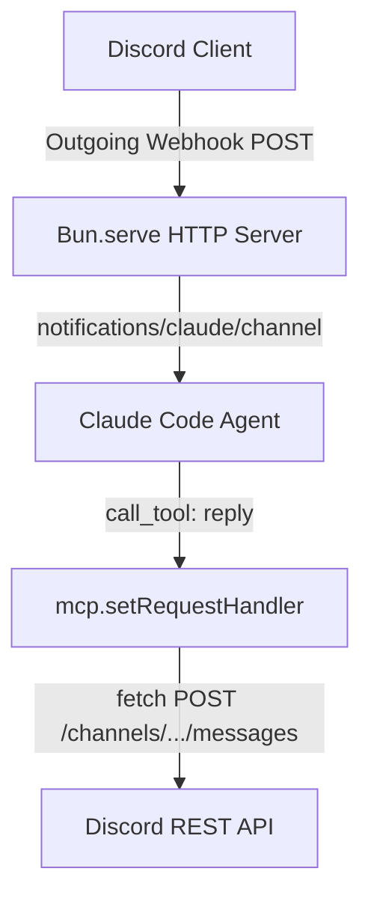

ความซับซ้อนที่ใหญ่ที่สุดประการหนึ่งในการสร้างบอท Discord คือการใช้ไลบรารีขนาดใหญ่เช่น `discord.js` เพื่อสร้างการเชื่อมต่อแบบ WebSocket ค้างไว้กับเซิร์ฟเวอร์ดิสคอร์ด (Gateway Connection) ซึ่งในสภาพแวดล้อมที่จำกัด เช่น เครื่องเซิร์ฟเวอร์แม่ `ai-core` การปล่อยบอท WebSocket รันค้างไว้อาจนำมาซึ่งปัญหาหน่วยความจำรั่วไหล (Memory Leak) หรือปัญหาการยกเลิกการเชื่อมต่อกะทันหัน

บทความนี้จะเปิดมิติใหม่ของการพัฒนา ด้วยการถอดรูปแบบบอทแบบเดิมออกไปทั้งหมด แล้วเปลี่ยนมาใช้สถาปัตยกรรม **"HTTP Webhook & REST API"** ที่บริสุทธิ์และเบาบางที่สุด โดยไม่ใช้ไลบรารีภายนอกเลยแม้แต่บรรทัดเดียว!

---

## 📡 1. สถาปัตยกรรมไร้การเชื่อมต่อ (Connectionless Architecture)

สถาปัตยกรรมนี้แบ่งการรับส่งข้อมูลออกเป็นสองขั้วอิสระจากกันอย่างสิ้นเชิง โดยคุยผ่านโปรโตคอล HTTP มาตรฐาน:



1. **Inbound (ขารับข้อความ)**:
   สร้าง HTTP server ด้วย `Bun.serve` เพื่อสแตนด์บายคอยรับ POST request จาก webhook relay เมื่อได้รับ JSON payload ก็จะแกะเนื้อหาและยิง `notifications/claude/channel` เข้าไปยัง Claude Code ผ่าน Stdio ทันที
2. **Outbound (ขาส่งกลับ)**:
   เมื่อบอทประมวลผลเสร็จและส่งข้อมูลกลับผ่านทูล `reply` ตัวเซิร์ฟเวอร์จะใช้คำสั่ง `fetch` ยิง POST request ไปที่ Discord REST API v10 `/channels/{id}/messages` โดยระบุ Token ใน Header ตรงๆ

---

## 📄 2. ซอร์สโค้ดฉบับเต็ม (`webhook_server.ts`)

นี่คือโค้ดทั้งหมดที่สร้างขึ้นใหม่ในพิกัด `scratch/minimal-discord/webhook_server.ts` ซึ่งยาวประมาณ 90 บรรทัดและทำงานได้อย่างรวดเร็ว:

```typescript
#!/usr/bin/env bun
/**
 * Minimal Webhook-based Discord MCP Gateway for Claude Code.
 * HTTP Server version (No Discord Gateway WebSocket, no 'discord.js').
 */

import { Server } from '@modelcontextprotocol/sdk/server/index.js'
import { StdioServerTransport } from '@modelcontextprotocol/sdk/server/stdio.js'
import { ListToolsRequestSchema, CallToolRequestSchema } from '@modelcontextprotocol/sdk/types.js'
import { readFileSync, existsSync } from 'fs'
import { homedir } from 'os'
import { join } from 'path'

const PORT = Number(process.env.DISCORD_WEBHOOK_PORT ?? 8788)
const STATE_DIR = join(homedir(), '.claude', 'channels', 'discord')
const ENV_FILE = join(STATE_DIR, '.env')

// Load token from local config
let token = process.env.DISCORD_BOT_TOKEN
if (!token && existsSync(ENV_FILE)) {
  const m = readFileSync(ENV_FILE, 'utf8').match(/^DISCORD_BOT_TOKEN=(.+)$/m)
  if (m) token = m[1].trim()
}

if (!token) {
  process.stderr.write(`Error: DISCORD_BOT_TOKEN is required. Set it in ${ENV_FILE}\n`)
  process.exit(1)
}

// 1. Setup MCP Server
const mcp = new Server(
  { name: 'discord-webhook-minimal', version: '0.1.0' },
  {
    capabilities: { tools: {}, experimental: { 'claude/channel': {} } },
    instructions: `You are connected to a webhook-based Discord channel. Use the 'reply' tool to reply back to the active channel_id.`,
  },
)

mcp.setRequestHandler(ListToolsRequestSchema, async () => ({
  tools: [
    {
      name: 'reply',
      description: 'Send a message back to the active Discord channel via HTTP REST API.',
      inputSchema: {
        type: 'object',
        properties: {
          text: { type: 'string', description: 'Message body to send' },
          channel_id: { type: 'string', description: 'Discord channel ID to send' },
        },
        required: ['text', 'channel_id'],
      },
    },
  ],
}))

mcp.setRequestHandler(CallToolRequestSchema, async req => {
  const args = (req.params.arguments ?? {}) as { text: string; channel_id: string }
  try {
    if (req.params.name === 'reply') {
      // Outbound message via standard Discord HTTP API
      const res = await fetch(`https://discord.com/api/v10/channels/${args.channel_id}/messages`, {
        method: 'POST',
        headers: {
          Authorization: `Bot ${token}`,
          'Content-Type': 'application/json',
          'User-Agent': 'maw-minimal-discord-webhook/1.0',
        },
        body: JSON.stringify({ content: args.text }),
      })

      if (res.status >= 300) {
        const errorText = await res.text()
        throw new Error(`Discord API returned status ${res.status}: ${errorText}`)
      }

      return { content: [{ type: 'text', text: 'sent' }] }
    }
    throw new Error(`Unknown tool: ${req.params.name}`)
  } catch (err: any) {
    return { content: [{ type: 'text', text: `Error: ${err.message}` }], isError: true }
  }
})

// 2. Setup HTTP Webhook Server using Bun.serve
Bun.serve({
  port: PORT,
  hostname: '127.0.0.1',
  async fetch(req) {
    const url = new URL(req.url)

    // Accept webhook incoming messages at POST /
    if (req.method === 'POST') {
      try {
        const body = await req.json() as {
          content: string
          channel_id: string
          message_id: string
          author: { username: string; id: string; bot?: boolean }
          timestamp?: string
        }

        if (body.author?.bot) {
          return new Response('Ignored bot message', { status: 200 })
        }

        await mcp.notification({
          method: 'notifications/claude/channel',
          params: {
            content: body.content,
            meta: {
              chat_id: body.channel_id,
              message_id: body.message_id,
              user: body.author.username,
              user_id: body.author.id,
              ts: body.timestamp ?? new Date().toISOString(),
            },
          },
        })

        return new Response('Received', { status: 200 })
      } catch (err: any) {
        return new Response(`Error: ${err.message}`, { status: 400 })
      }
    }

    return new Response('Minimal Webhook Server is running.', { status: 200 })
  },
})

// 3. Connect Transport
await mcp.connect(new StdioServerTransport())
process.stderr.write(`Minimal Discord Webhook MCP Server online at http://localhost:${PORT}\n`)
```

---

## 🎯 3. สรุปความได้เปรียบทางวิศวกรรม (Engineering Advantages)

*   **Zero Dependencies**: ไม่ต้องติดตั้งไลบรารี `discord.js` หรือแพ็กเกจช่วยรันขนาดใหญ่ ทำให้การ deploy ทำได้รวดเร็วมากและไม่ต้องมี `node_modules` หนักหน่วงในบางส่วน
*   **Idle Performance (การประหยัดพลังงาน)**: เนื่องจากไม่มีการเชื่อมต่อ WebSocket ดึงข้อมูลค้างไว้ (Keepalive) ทำให้ CPU และ RAM อยู่ในระดับต่ำมากยามว่างงาน
*   **Highly Extensible**: เราสามารถแปลงพอร์ต `Bun.serve` ให้ต่อตรงเข้ากับ API Gateway หรือ Cloudflare Tunnels เพื่อเปิดรับ Webhook จาก Discord ได้ทันที ไร้ข้อจำกัดทางเครือข่ายครับ!
