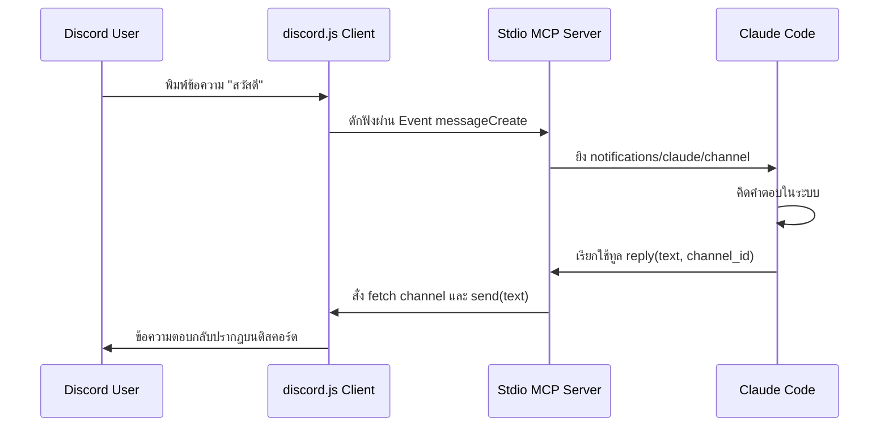

บอท Discord MCP Gateway ดั้งเดิมของ Anthropic มีขนาดโค้ดร่วม 900 บรรทัด เนื่องจากต้องบรรทุกความซับซ้อนของระบบอนุญาตสิทธิ์ระดับองค์กร เช่น กลไก Pairing Code 6 หลักผ่าน SMS การสลับ allowlist นโยบาย Guild/DM controls และการจัดคิว Pending actions

แต่ทว่า หากเราศึกษาตัวอย่างจากไฟล์ **`fakechat/server.ts`** ของทางการ เราจะพบความจริงที่สวยงามว่า สาระสำคัญของการส่งผ่านข้อมูลของ AI Agent ไปยังช่องทางแชทภายนอก (Channel capability) แท้จริงแล้วใช้สัญญานโค้ดเพียงแค่ไม่กี่บรรทัดเท่านั้น!

บทความนี้จะวิเคราะห์โค้ดเบื้องหลังและสร้างพิมพ์เขียว **Minimal Discord Channel** ที่ย่นย่อเหลือเพียง 90 บรรทัดด้วย Bun และ Model Context Protocol (MCP) SDK

---

## 🛠️ 1. สถาปัตยกรรมเรียบง่าย: เปรียบเทียบ Fakechat vs Minimal Discord

ใน `fakechat` ของทางการ ความลับในการจำลองตัวแปรช่องทางรับส่งข้อความอยู่ที่การลงทะเบียน Capability พิเศษชื่อ `experimental: { 'claude/channel': {} }` ลงบน MCP Server เพื่อบอกให้ Claude Code ทราบว่ากระแสข้อมูลทั้งหมดจะถูกขับเคลื่อนด้วย Notification และ Custom Tool



เมื่อใช้รูปแบบนี้ เราไม่จำเป็นต้องเชื่อมต่อ Web UI หรือประยุกต์ใช้ฐานข้อมูลความเสี่ยงใดๆ เลย แต่เพียงแค่ปล่อยให้ Stdio Server ทำหน้าที่ประสานระหว่าง Discord client และ Claude Code ตรงๆ

---

## 📄 2. ซอร์สโค้ด Minimal Gateway ตัวเต็ม (`server.ts`)

นี่คือโค้ดทั้งหมดที่สร้างขึ้นใหม่ในพิกัด `scratch/minimal-discord/server.ts` ซึ่งถอดลอจิกเทอะทะออกไปทั้งหมด โดยไม่มี Access Control, Pairing หรือนโยบายกลุ่ม:

```typescript
#!/usr/bin/env bun
/**
 * Minimal Discord Channel Gateway for Claude Code.
 * Inspired by 'fakechat' official implementation.
 */

import { Server } from '@modelcontextprotocol/sdk/server/index.js'
import { StdioServerTransport } from '@modelcontextprotocol/sdk/server/stdio.js'
import { ListToolsRequestSchema, CallToolRequestSchema } from '@modelcontextprotocol/sdk/types.js'
import { Client, GatewayIntentBits, Partials, type Message } from 'discord.js'
import { readFileSync, existsSync } from 'fs'
import { homedir } from 'os'
import { join } from 'path'

const STATE_DIR = join(homedir(), '.claude', 'channels', 'discord')
const ENV_FILE = join(STATE_DIR, '.env')

// 1. ดึง Token จาก config โลคัล
let token = process.env.DISCORD_BOT_TOKEN
if (!token && existsSync(ENV_FILE)) {
  const m = readFileSync(ENV_FILE, 'utf8').match(/^DISCORD_BOT_TOKEN=(.+)$/m)
  if (m) token = m[1].trim()
}

if (!token) {
  process.stderr.write(`Error: DISCORD_BOT_TOKEN is required. Set it in ${ENV_FILE}\n`)
  process.exit(1)
}

// 2. Setup Discord Client (Minimal Intents & Partials)
const client = new Client({
  intents: [
    GatewayIntentBits.DirectMessages,
    GatewayIntentBits.Guilds,
    GatewayIntentBits.GuildMessages,
    GatewayIntentBits.MessageContent,
  ],
  partials: [Partials.Channel],
})

// 3. Setup MCP Server (เปิดใช้ Claude Channel capability)
const mcp = new Server(
  { name: 'discord-minimal', version: '0.1.0' },
  {
    capabilities: { tools: {}, experimental: { 'claude/channel': {} } },
    instructions: `You are connected to a minimal Discord channel. Use the 'reply' tool to reply back to the current active chat_id/channel.`,
  },
)

mcp.setRequestHandler(ListToolsRequestSchema, async () => ({
  tools: [
    {
      name: 'reply',
      description: 'Send a message back to the active Discord channel/user.',
      inputSchema: {
        type: 'object',
        properties: {
          text: { type: 'string', description: 'Message body to send' },
          channel_id: { type: 'string', description: 'Discord channel ID to direct reply' },
        },
        required: ['text', 'channel_id'],
      },
    },
  ],
}))

mcp.setRequestHandler(CallToolRequestSchema, async req => {
  const args = (req.params.arguments ?? {}) as { text: string; channel_id: string }
  try {
    if (req.params.name === 'reply') {
      const channel = await client.channels.fetch(args.channel_id)
      if (channel && 'send' in channel) {
        await (channel as any).send(args.text)
        return { content: [{ type: 'text', text: 'sent' }] }
      }
      throw new Error(`Channel ${args.channel_id} is not writable.`)
    }
    throw new Error(`Unknown tool: ${req.params.name}`)
  } catch (err: any) {
    return { content: [{ type: 'text', text: `Error: ${err.message}` }], isError: true }
  }
})

// 4. ดักจับข้อความเข้าแล้วแจ้งเตือนไปที่ Claude Code
client.on('messageCreate', async (msg: Message) => {
  if (msg.author.bot) return // ป้องกันการวนลูปไม่รู้จบ

  await mcp.notification({
    method: 'notifications/claude/channel',
    params: {
      content: msg.content,
      meta: {
        chat_id: msg.channelId,
        message_id: msg.id,
        user: msg.author.username,
        ts: msg.createdAt.toISOString(),
      },
    },
  })
})

// 5. รันเชื่อมต่อ Stdio และเข้าสู่ระบบบอทดิสคอร์ด
await mcp.connect(new StdioServerTransport())
await client.login(token)
process.stderr.write('Minimal Discord Channel MCP Server online\n')
```

---

## 💡 3. ความคลาสสิกที่ได้รับจากการศึกษา Fakechat

1. **การกำจัด Middleware เทอะทะ**: ในเวอร์ชันตัวเต็มจะมีฟังก์ชันตรวจสอบ authorization ค่อนข้างหนักหน่วง แต่ถ้าหากเป็นช่องทางส่วนตัวที่บอทรันเฉพาะบนเครื่องเครื่องเดียวแบบ Localhost Stdio เราสามารถตัด middleware ออกเพื่อเพิ่มความเร็วในการส่งผ่านข้อมูล (Latency) ได้ทันที
2. **Standard Stdio Transport**: สัญญาน MCP ไม่ต้องเปิดพอร์ต HTTP ภายนอกให้มีความเสี่ยงต่อการโดนสแกนพอร์ต เพราะ Bun สามารถสร้าง Subprocess และสื่อสารผ่าน `stdin`/`stdout` ของระบบได้โดยตรง
3. **การหลอมข้อความ**: ใน `fakechat` การส่งไฟล์และข้อความจะยุบรวมเข้าเป็นก้อนเดียว ทำให้ระบบเรนเดอร์ไม่ต้องรันลูปยิง API หลายรอบ ซึ่งลดความเสี่ยงต่อการถูก Rate limit ของ Discord ลงได้อย่างมหาศาลครับ
