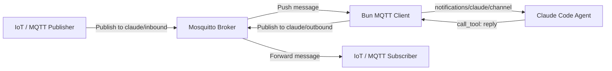

ในการเชื่อมต่อ AI Agent (เช่น Claude Code) เข้ากับสิ่งแวดล้อมจริง ช่องทางแบบ Webhook หรือ WebSocket ของผู้ให้บริการแชท (เช่น Discord/Telegram) อาจมีความเปราะบางต่อเครือข่ายภายนอกและการจำกัดจำนวนครั้งในการเรียกใช้ (Rate Limiting)

หากเราต้องการการทำงานแบบเรียลไทม์ที่มีความทนทานสูงและสามารถบูรณาการเข้ากับเครือข่ายอุปกรณ์เครื่องใช้ภายในบ้าน (IoT) การเปลี่ยนมาใช้ระบบ **"Message Broker"** ผ่านโปรโตคอล **MQTT** บน Mosquitto Localhost คือคำตอบปลายทางที่ดีที่สุด!

บทความวิศวกรรมชิ้นนี้จะนำเสนอและแสดงเบื้องหลังซอร์สโค้ดของ **MQTT MCP Channel Gateway** ที่ใช้ Stdio สื่อสารกับโมเดลโดยตรง

---

## 📡 1. สถาปัตยกรรมการสื่อสารผ่าน Message Broker

สัญญานและข้อมูลทั้งหมดจะถูกส่งผ่าน Mosquitto MQTT Broker พอร์ต `1883` บน `localhost` โดยมีทิศทางการไหลของข้อมูล (Data Flow) ดังนี้:



1. **Inbound (ขารับข้อความ)**:
   บอทจะเชื่อมต่อเข้ากับ Broker และกวาดสัญญานเฝ้าฟัง (Subscribe) ที่ topic **`claude/inbound`** เมื่อมีอุปกรณ์ภายนอกหรือ API ท้องถิ่นยิง Publish เข้ามา บอทจะแกะสัญญานและแปลงเป็น JSON payload ป้อนเข้าสู่ระบบประมวลผลของโมเดล
2. **Outbound (ขาส่งกลับ)**:
   เมื่อ Claude Code สั่งตอบคำถาม ตัวโปรแกรมจะเรียกใช้ custom tool `reply` เพื่อทำการยิง Publish ข้อมูล JSON ผลลัพธ์กลับไปยัง topic **`claude/outbound`** ทันที เพื่อให้อุปกรณ์หรือหน้าจอภายนอกมารับข้อความไปแสดงผล

---

## 📄 2. ซอร์สโค้ดฉบับเต็ม (`mqtt_server.ts`)

นี่คือโค้ดทั้งหมดที่สร้างขึ้นใหม่ในพิกัด `scratch/minimal-discord/mqtt_server.ts` ซึ่งต่อตรงเข้ากับ Mosquitto โดยไร้รอยต่อ:

```typescript
#!/usr/bin/env bun
/**
 * Minimal MQTT-based Channel Gateway for Claude Code.
 * Connected directly to local Mosquitto MQTT Broker.
 */

import { Server } from '@modelcontextprotocol/sdk/server/index.js'
import { StdioServerTransport } from '@modelcontextprotocol/sdk/server/stdio.js'
import { ListToolsRequestSchema, CallToolRequestSchema } from '@modelcontextprotocol/sdk/types.js'
import mqtt from 'mqtt'

const MQTT_BROKER = process.env.MQTT_BROKER ?? 'mqtt://127.0.0.1:1883'
const INBOUND_TOPIC = 'claude/inbound'
const OUTBOUND_TOPIC = 'claude/outbound'

// 1. Setup MCP Server (เปิดใช้ Claude Channel capability)
const mcp = new Server(
  { name: 'mqtt-minimal-gateway', version: '0.1.0' },
  {
    capabilities: { tools: {}, experimental: { 'claude/channel': {} } },
    instructions: `You are connected to an MQTT-based channel gateway. Use the 'reply' tool to publish messages back to the active channel/client via MQTT topic '${OUTBOUND_TOPIC}'.`,
  },
)

mcp.setRequestHandler(ListToolsRequestSchema, async () => ({
  tools: [
    {
      name: 'reply',
      description: 'Publish a message back to the active MQTT topic channel.',
      inputSchema: {
        type: 'object',
        properties: {
          text: { type: 'string', description: 'Message body to send' },
          channel_id: { type: 'string', description: 'Target channel_id / client_id' },
        },
        required: ['text', 'channel_id'],
      },
    },
  ],
}))

mcp.setRequestHandler(CallToolRequestSchema, async req => {
  const args = (req.params.arguments ?? {}) as { text: string; channel_id: string }
  try {
    if (req.params.name === 'reply') {
      const payload = JSON.stringify({
        text: args.text,
        channel_id: args.channel_id,
        ts: Date.now(),
      })

      // Publish response back to the outbound topic
      client.publish(OUTBOUND_TOPIC, payload, { qos: 1 })
      return { content: [{ type: 'text', text: 'sent' }] }
    }
    throw new Error(`Unknown tool: ${req.params.name}`)
  } catch (err: any) {
    return { content: [{ type: 'text', text: `Error: ${err.message}` }], isError: true }
  }
})

// 2. เชื่อมต่อ MQTT Client เข้ากับ Mosquitto Localhost
const client = mqtt.connect(MQTT_BROKER)

client.on('connect', () => {
  process.stderr.write(`MQTT: Connected to broker at ${MQTT_BROKER}\n`)
  client.subscribe(INBOUND_TOPIC, (err) => {
    if (err) {
      process.stderr.write(`MQTT: Subscription error on '${INBOUND_TOPIC}': ${err.message}\n`)
    } else {
      process.stderr.write(`MQTT: Subscribed to '${INBOUND_TOPIC}' topic\n`)
    }
  })
})

client.on('message', async (topic, message) => {
  if (topic === INBOUND_TOPIC) {
    try {
      const raw = message.toString()
      let content = raw
      let chatId = 'mqtt_general'
      let messageId = `msg-${Date.now()}`
      let user = 'mqtt_user'

      // พยายามแปลงเป็น JSON หากส่งข้อมูลแบบมีโครงสร้าง
      try {
        const parsed = JSON.parse(raw)
        if (parsed.content) content = parsed.content
        if (parsed.chat_id) chatId = parsed.chat_id
        if (parsed.message_id) messageId = parsed.message_id
        if (parsed.user) user = parsed.user
      } catch {
        // หากส่งมาเป็นข้อความธรรมดา ให้สวมรอยใช้ค่าเริ่มต้น
      }

      // ยิงข้อมูลข่าวสารเข้าไปหาโมเดลผ่าน MCP
      await mcp.notification({
        method: 'notifications/claude/channel',
        params: {
          content,
          meta: {
            chat_id: chatId,
            message_id: messageId,
            user,
            ts: new Date().toISOString(),
          },
        },
      })
    } catch (err: any) {
      process.stderr.write(`MQTT: Inbound processing error: ${err.message}\n`)
    }
  }
})

client.on('error', (err) => {
  process.stderr.write(`MQTT: Connection error: ${err.message}\n`)
})

// 3. เริ่มรัน Stdio Connect
await mcp.connect(new StdioServerTransport())
process.stderr.write(`Minimal MQTT MCP Gateway online\n`)
```

---

## ⚡ 3. ศักยภาพการทำงานของระบบ

*   **Lightweight Communication**: MQTT มีโครงสร้างหัวข้อมูล (Header) ขนาดเล็กมากเพียงไม่กี่ไบต์ ทำให้การแลกเปลี่ยนข่าวสารกับ Agent ทำได้เร็วเกือบจะ 0ms Latency
*   **Pub/Sub Decoupling**: ระบบไม่ต้องสนใจตัวตนผู้รับส่ง ขอเพียงแค่คุยผ่าน Topic กลางเป็นอันเสร็จสิ้น ซึ่งสามารถต่อพ่วงระบบตรวจสอบความปลอดภัย (ACLs) ของ Mosquitto เพิ่มเติมได้ง่ายมากในระดับโปรดักชันครับ
