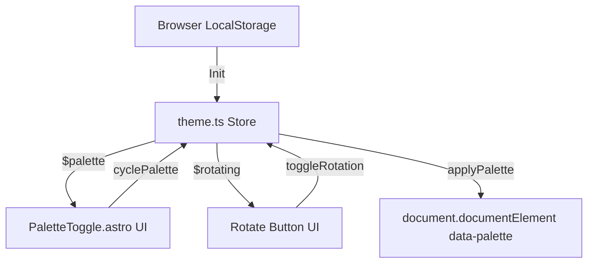

# API & Integration Surface: Landing Oracle

This document analyzes and catalogs the API definitions, extension points, state management integration, and build configurations for the **Landing Oracle** codebase located at `ψ/learn/Oracle-Landing/landing-oracle/origin/`.

---

## 1. Domain & Routing Structure (Public API)

Because the project is configured as a Static Site (SSG), it does not expose dynamic Server-Side (SSR) HTTP endpoint scripts. Instead, routing is static, and deployment mappings are bound to custom domains via Cloudflare.

### Route Map
- **`/` (Entry Point)**: Maps to [index.astro](file:///root/Code/github.com/MEYD-605/gemini-oracle/ψ/learn/Oracle-Landing/landing-oracle/origin/src/pages/index.astro).
- **Custom Domains**: Configured in [wrangler.toml](file:///root/Code/github.com/MEYD-605/gemini-oracle/ψ/learn/Oracle-Landing/landing-oracle/origin/wrangler.toml) mapping static assets (`./dist`) to:
  - `gallery.buildwithoracle.com`
  - `landing.buildwithoracle.com`

---

## 2. Content Layer Schema (Static Data Integration)

All data about Oracles is managed statically through Astro Content Collections (defined in [content.config.ts](file:///root/Code/github.com/MEYD-605/gemini-oracle/ψ/learn/Oracle-Landing/landing-oracle/origin/src/content.config.ts)).

### Collections Specification

```typescript
const oracles = defineCollection({
  loader: glob({ pattern: "**/*.md", base: "./src/data/oracles" }),
  schema: z.object({
    name: z.string(),
    number: z.string().optional(),
    domain: z.string().optional(),
    primary: z.string(),        // Primary color token (hex/rgb)
    secondary: z.string(),      // Secondary color token (hex/rgb)
    background: z.string(),     // Brand background color
    stack: z.array(z.string()).optional(), // Tech stack list
    screenshot: z.string().optional(),     // Asset URL or path to screenshot
    status: z.enum(["live", "known"]),    // Oracle web status
  }),
});
```

- **Data Files Source**: Managed under `./src/data/oracles/*.md` (e.g., [gemini.md](file:///root/Code/github.com/MEYD-605/gemini-oracle/ψ/learn/Oracle-Landing/landing-oracle/origin/src/data/oracles/gemini.md), [antigravity.md](file:///root/Code/github.com/MEYD-605/gemini-oracle/ψ/learn/Oracle-Landing/landing-oracle/origin/src/data/oracles/antigravity.md)).
- **Integration Use-case**: At build-time, Astro queries the local markdown files, parses their frontmatter, validates them against the schema, and builds them into the output HTML bundle.

---

## 3. State Management (Theme Integration)

The project leverages [nanostores](https://github.com/nanostores/nanostores) for client-side state coordination, bypassing heavy client frameworks like React or Svelte.

### Stores definition: [theme.ts](file:///root/Code/github.com/MEYD-605/gemini-oracle/ψ/learn/Oracle-Landing/landing-oracle/origin/src/stores/theme.ts)

- **`$palette`**: `atom<"clarity" | "royal" | "nature">` (Current UI Theme Palette)
- **`$rotating`**: `atom<boolean>` (State flag for auto-rotating themes)



### Action Dispatchers
- `initPalette()`: Evaluates local storage for `landing-oracle-palette` and `landing-oracle-rotate`. Restores state and triggers initial rotation timer.
- `cyclePalette()`: Advances the active theme manually and locks user setting (`landing-oracle-rotate: off`).
- `toggleRotation()`: Enables or disables the automatic 6-second rotation interval.

---

## 4. Extension & Integration Patterns

### 1. FOUC Prevention Hook (Flash of Unstyled Content)
To ensure the correct visual theme loads before rendering starts (avoiding light/dark flash), an inline blocker script is injected directly in [Base.astro](file:///root/Code/github.com/MEYD-605/gemini-oracle/ψ/learn/Oracle-Landing/landing-oracle/origin/src/layouts/Base.astro):

```html
<script is:inline>
  (function () {
    var p = localStorage.getItem("landing-oracle-palette");
    if (p && ["clarity", "royal", "nature"].indexOf(p) !== -1) {
      document.documentElement.setAttribute("data-palette", p);
    } else {
      document.documentElement.setAttribute("data-palette", "clarity");
    }
  })();
</script>
```

### 2. DOM Dataset Data-Binding
Astro pre-renders metadata tags directly to component containers as standard `data-*` properties (see [GalleryCard.astro](file:///root/Code/github.com/MEYD-605/gemini-oracle/ψ/learn/Oracle-Landing/landing-oracle/origin/src/components/GalleryCard.astro)):

```html
<a
  href={`https://${oracle.domain}`}
  data-name={oracle.name.toLowerCase()}
  data-stack={oracle.stack?.join(",").toLowerCase() ?? ""}
  class="gallery-card ..."
>
```

This dataset works as a **declarative data bridge** between server-side generation and vanilla client-side script queries (like in page search filters), eliminating the need for an external API query.

### 3. Client-Side Interactive Filters
The main page embeds a scoped script that observes interactive elements (`#gallery-search` and `.filter-chip`) to dynamic-filter elements on the screen in real-time by toggling CSS class `.hidden-by-filter`:

```typescript
function applyFilters() {
  const query = searchInput?.value.toLowerCase().trim() ?? "";
  cards.forEach((card) => {
    const name = card.dataset.name ?? "";
    const stack = card.dataset.stack ?? "";
    const matchesSearch = !query || name.includes(query) || stack.includes(query);
    const matchesFilter = activeFilter === "all" || stack.includes(activeFilter);
    card.classList.toggle("hidden-by-filter", !(matchesSearch && matchesFilter));
  });
}
```

---

## 5. Build & Infrastructure Configs

### Cloudflare Integration
- **Platform**: Cloudflare Workers Assets.
- **Wranger Config ([wrangler.toml](file:///root/Code/github.com/MEYD-605/gemini-oracle/ψ/learn/Oracle-Landing/landing-oracle/origin/wrangler.toml))**:
  - `compatibility_date = "2025-06-01"`
  - `[assets] directory = "./dist"` - Routes all matching assets from Astro's output.

### Vite Plugins & Customizations ([astro.config.mjs](file:///root/Code/github.com/MEYD-605/gemini-oracle/ψ/learn/Oracle-Landing/landing-oracle/origin/astro.config.mjs))
- **CSS Preprocessor**: Tailwind CSS v4 is bound via `@tailwindcss/vite` plugin.
- **Server File Ignore**: 
  ```javascript
  ignored: ["**/ψ/**"]
  ```
  The Astro dev server is instructed to completely ignore files inside the `**/ψ/**` directory (the Council Shared Memory / logs). This prevents circular dev-mode rebuild loops when agent logging occurs.
