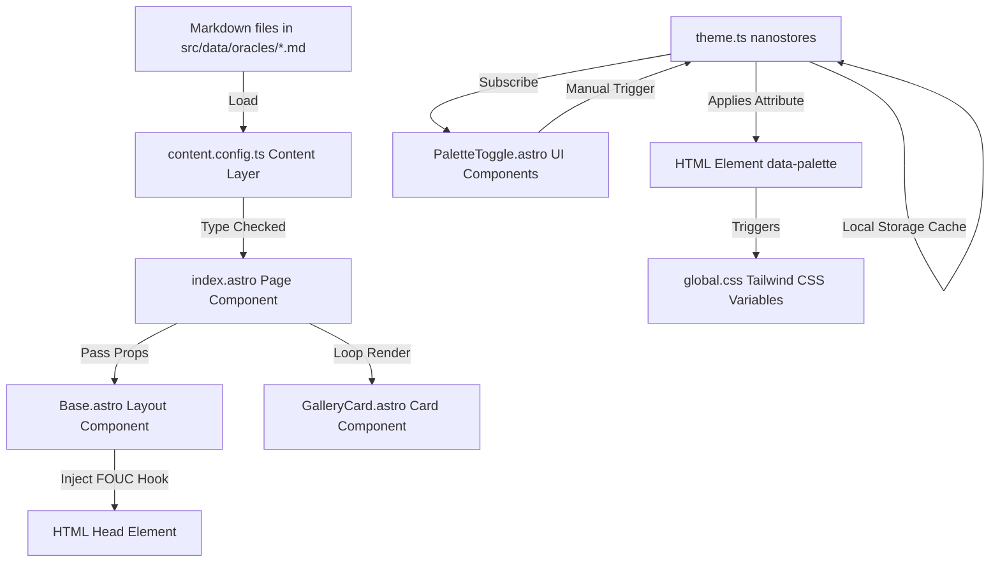

# System Architecture: Landing Oracle

This document provides a comprehensive analysis of the system architecture, directory organization, entry points, core abstractions, and dependency structure of the **Landing Oracle** (Oracle #154) web presence consultant application located at `ψ/learn/Oracle-Landing/landing-oracle/origin/`.

---

## 1. Architectural Philosophy & Context

The Landing Oracle is designed with the primary goal of providing a fast, lightweight, and responsive gallery for all Oracles at `gallery.buildwithoracle.com` and `landing.buildwithoracle.com`. 

### Key Design Pillars
1. **SSG (Static Site Generation)**: All dynamic page data (the gallery of Oracles) is compiled at build-time into static assets. Zero database lookups occur at runtime.
2. **Framework-Agnostic Client State**: Avoids heavy UI runtimes (like React or Vue) in favor of vanilla Astro components and micro-state management ([nanostores](file:///root/Code/github.com/MEYD-605/gemini-oracle/ψ/learn/Oracle-Landing/landing-oracle/origin/package.json#L13)) to control client-side behaviors.
3. **Decoupled Styling**: Uses Tailwind CSS v4 compiled via `@tailwindcss/vite` integrated with CSS Custom Properties to dynamic-switch color palettes cleanly.

---

## 2. Directory Structure & Organization

The codebase is structured around a typical Astro layout but is designed to maintain a clean separation of content (individual profiles) and system state.

```
/landing-oracle/origin/
├── .claude/                   # Local agent utilities & skills
├── public/                    # Static assets (favicons, screenshots)
├── src/
│   ├── components/            # Isolated, reusable UI blocks
│   │   ├── GalleryCard.astro  # Individual Oracle card rendering
│   │   ├── Nav.astro          # Floating top navigation bar
│   │   └── PaletteToggle.astro# Core client-side theme controls
│   ├── data/
│   │   └── oracles/           # System database: individual markdown profiles
│   ├── layouts/
│   │   └── Base.astro         # Shell template (FOUC hook, CSS injection)
│   ├── pages/
│   │   └── index.astro        # The single web page entry point
│   ├── stores/
│   │   └── theme.ts           # State engine for theme routing
│   ├── styles/
│   │   └── global.css         # Styling system & Tailwind compilation rules
│   ├── content.config.ts      # Astro Content Layer database setup
│   └── env.d.ts               # Global TypeScript definitions
├── astro.config.mjs           # Bundler and framework config
├── wrangler.toml              # Cloudflare Pages custom routing configuration
├── package.json               # Node dependency manifest
├── tsconfig.json              # TypeScript engine compiler options
└── ψ/                         # System memory and research logs (ignored by watch)
```

### Organization Rationale
- **`src/data/oracles/` as the Database**: Storing Oracle information in discrete Markdown files follows the *Nothing is Deleted* principle. Adding or modifying an Oracle is as simple as committing a new Markdown profile.
- **`src/stores/` vs. Script Tags**: Complex UI states (such as active color palettes and rotation timers) are moved into central stores, separating UI components from the business logic of theme selection.
- **`ψ/` Ignored during Watch**: Because agents frequently write task notes and logs inside `ψ/`, the dev server ignores changes within this folder (`watch.ignored: ["**/ψ/**"]`) to prevent constant, unnecessary browser refreshes.

---

## 3. System Entry Points

The Landing Oracle has three primary entry points: compilation configuration, hosting routes, and page routing.

### 1. Build and Bundling: [astro.config.mjs](file:///root/Code/github.com/MEYD-605/gemini-oracle/ψ/learn/Oracle-Landing/landing-oracle/origin/astro.config.mjs)
Determines how the code is compiled. 
- **SSG Target**: `output: "static"` configures the build script to output standard static files.
- **Cloudflare Integration**: Declares `adapter: cloudflare()` so that static output bundles perfectly with Cloudflare Pages/Workers hosting patterns.
- **Vite Integration**: Plugs in `tailwindcss()` directly at the Vite compiler level rather than using an Astro middleware wrapper.

### 2. Hosting and Domain Routing: [wrangler.toml](file:///root/Code/github.com/MEYD-605/gemini-oracle/ψ/learn/Oracle-Landing/landing-oracle/origin/wrangler.toml)
Cloudflare's wrangler utility configures asset mapping and hosting routes.
- **Assets Mapping**: Maps the output directory `./dist` containing precompiled files.
- **Custom Domains**: Attaches the application to two subdomains:
  - `gallery.buildwithoracle.com`
  - `landing.buildwithoracle.com`

### 3. Page Engine: [index.astro](file:///root/Code/github.com/MEYD-605/gemini-oracle/ψ/learn/Oracle-Landing/landing-oracle/origin/src/pages/index.astro)
The single page entry point. During build time:
1. Calls `getCollection("oracles")` to fetch all files inside `src/data/oracles/`.
2. Computes statistic properties (live percentage, live/known/dim counts).
3. Injects components (`<Nav />`, `<GalleryCard />`, etc.).
4. Embeds small inline scripts for client-side interactivity (gallery text searching and category filtering).

---

## 4. Core Abstractions & Relationships

The application is built on top of a few core abstractions: **Content Schemas**, **Theme Palettes**, **Subscribed Stores**, and **Dataset Bindings**.



### 1. The Content Layer Database: [content.config.ts](file:///root/Code/github.com/MEYD-605/gemini-oracle/ψ/learn/Oracle-Landing/landing-oracle/origin/src/content.config.ts)
The Content Layer abstracts local files into a queryable dataset. Frontmatter values are strictly type-checked using Zod:
- `primary`/`secondary`/`background`: Color strings used to construct customizable inline styles per card.
- `status`: Specifies whether the Oracle landing page is `live` (deployed) or `known` (discovered but not fully configured).
- `screenshot`: Asset reference to the thumbnail image of the deployed page.

### 2. Micro-State Management: [theme.ts](file:///root/Code/github.com/MEYD-605/gemini-oracle/ψ/learn/Oracle-Landing/landing-oracle/origin/src/stores/theme.ts)
Bypasses large client UI frameworks by using `nanostores` atoms to establish reactive triggers:
- **`$palette` Store**: Holds the active palette value (`"clarity" | "royal" | "nature"`).
- **`$rotating` Store**: Flag signifying whether the auto-rotation system is spinning.
- **Applying Palettes**: Sets the custom data attribute `data-palette` on the document root (`document.documentElement`). 

### 3. CSS Theme Styling: [global.css](file:///root/Code/github.com/MEYD-605/gemini-oracle/ψ/learn/Oracle-Landing/landing-oracle/origin/src/styles/global.css)
Maps the `data-palette` attributes to CSS Custom Properties. Rather than hardcoding colors inside Tailwind classes, CSS properties are defined dynamically:
```css
html[data-palette="royal"] {
  --theme-bg: #0c0a1a;
  --theme-primary: #f59e0b;
  --theme-secondary: #8b5cf6;
}
```
Astro template tags style elements using these CSS variables (e.g. `border-[var(--theme-border)]` or `text-[var(--theme-text)]`), allowing instantaneous global design shifts without redrawing the DOM tree.

### 4. Client-side Dataset Data-Binding
Astro renders data attributes directly onto HTML nodes at build-time.
- **Precompiled attributes**: [GalleryCard.astro](file:///root/Code/github.com/MEYD-605/gemini-oracle/ψ/learn/Oracle-Landing/landing-oracle/origin/src/components/GalleryCard.astro) maps `data-name={oracle.name.toLowerCase()}` and `data-stack={...}` directly to the DOM wrapper.
- **Client query**: The filter script in `index.astro` retrieves these elements and filters them out by toggling a simple `.hidden-by-filter` display class, keeping client logic extremely fast.

---

## 5. Dependency Analysis & Integrations

The system avoids unnecessary package installations. Its dependencies can be grouped into two main categories:

### 1. Production Runtime Dependencies
- **`astro` (^5.17.1)**: Pre-renders pages, builds the HTML output, and packages styling assets.
- **`@astrojs/cloudflare` (^12.6.12)**: Serves as the compilation bridge, outputting the project bundle optimized for Cloudflare's runtime infrastructure.
- **`nanostores` (^1.1.0)**: Coordinates client state with a memory footprint of less than 1KB.

### 2. Development & Tooling Dependencies
- **`tailwindcss` (^4.1.18)** and **`@tailwindcss/vite` (^4.1.18)**: Direct Vite-based Tailwind v4 compilation. The compiler listens directly to file writes to rebuild critical CSS styles.
- **`wrangler` (^4.63.0)**: Used by build pipelines to push production directories directly to Cloudflare Pages.
- **`typescript` (^5.8.3)**: Provides strict type checking for configurations, stores, content layer loaders, and client scripts.
