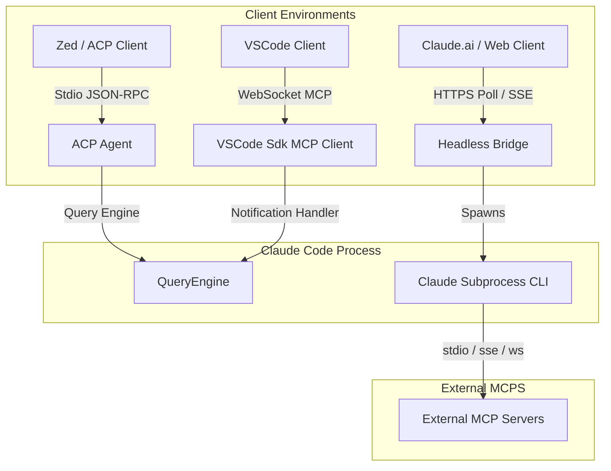

# Claude Code API Surface, Extension Points, Integration Patterns, & Plugin Architecture

This document presents a comprehensive analysis of the public API surface, extension systems, integration patterns, and plugin/middleware architecture of the **Claude Code** codebase, located under [origin/](file:///root/Code/github.com/MEYD-605/gemini-oracle/%CF%88/learn/claude-code-best/claude-code/origin/).

---

## 1. Public API & CLI Entry Points

Claude Code bootstraps through [cli.tsx](file:///root/Code/github.com/MEYD-605/gemini-oracle/%CF%88/learn/claude-code-best/claude-code/origin/src/entrypoints/cli.tsx), which parses flags and redirects execution paths to dedicated services or sub-actions.

### CLI Entry Point Bootstrap: [cli.tsx](file:///root/Code/github.com/MEYD-605/gemini-oracle/%CF%88/learn/claude-code-best/claude-code/origin/src/entrypoints/cli.tsx)
The CLI fast-paths performance-sensitive commands before importing the heavier React/Ink TUI dependencies:
- **Version Check**: `claude -v` or `claude --version` is parsed immediately with zero module loads.
- **System Prompt Dump**: `--dump-system-prompt` outputs the system prompt (evaluating GrowthBook/feature flags) and exits.
- **MCP Servers**: Handles Chrome extension and computer use MCP integrations:
  - `--claude-in-chrome-mcp` (calls `runClaudeInChromeMcpServer`)
  - `--chrome-native-host` (calls `runChromeNativeHost`)
  - `--computer-use-mcp` (calls `runComputerUseMcpServer`)
- **Agent Client Protocol (ACP)**: `--acp` starts the stdio agent mode (calls `runAcpAgent` in [acp/entry.ts](file:///root/Code/github.com/MEYD-605/gemini-oracle/%CF%88/learn/claude-code-best/claude-code/origin/src/services/acp/entry.ts)).
- **WeChat Serve**: `weixin` routes directly to `handleWeixinCli` from the `@claude-code-best/weixin` package.
- **Daemon worker supervisor**: `--daemon-worker=<kind>` starts a supervised background worker.
- **Bridge Remote Control**: `remote-control`, `rc`, `remote`, `sync`, or `bridge` launches bridge mode (calls `bridgeMain` in [bridgeMain.ts](file:///root/Code/github.com/MEYD-605/gemini-oracle/%CF%88/learn/claude-code-best/claude-code/origin/src/bridge/bridgeMain.ts)).
- **Daemon/Session Control**: `daemon` (calls `daemonMain` in [daemon/main.ts](file:///root/Code/github.com/MEYD-605/gemini-oracle/%CF%88/learn/claude-code-best/claude-code/origin/src/daemon/main.ts)).
- **Autonomy Mode**: `autonomy` reads automatic autonomy configurations.
- **Template Jobs**: `job` starts templates execution.

### TUI Entry Point: [main.tsx](file:///root/Code/github.com/MEYD-605/gemini-oracle/%CF%88/learn/claude-code-best/claude-code/origin/src/main.tsx)
If no fast-path flags match, the TUI is loaded via [main.tsx](file:///root/Code/github.com/MEYD-605/gemini-oracle/%CF%88/learn/claude-code-best/claude-code/origin/src/main.tsx). It uses Commander.js to configure CLI options and registers interactive subcommands.

### Stdio-based ACP Interface: [acp/entry.ts](file:///root/Code/github.com/MEYD-605/gemini-oracle/%CF%88/learn/claude-code-best/claude-code/origin/src/services/acp/entry.ts)
The ACP (Agent Client Protocol) allows external applications (e.g. Zed editor) to control Claude Code over stdio:
- [createAcpStream](file:///root/Code/github.com/MEYD-605/gemini-oracle/%CF%88/learn/claude-code-best/claude-code/origin/src/services/acp/entry.ts#L11-L22) converts `process.stdin` and `process.stdout` into a web standard `ReadableStream` and `WritableStream` framed by NDJSON.
- An instance of [AcpAgent](file:///root/Code/github.com/MEYD-605/gemini-oracle/%CF%88/learn/claude-code-best/claude-code/origin/src/services/acp/agent/AcpAgent.ts#L69) is bound to the connection, dispatching requests like `newSession`, `loadSession`, `listSessions`, `unstable_resumeSession`, `unstable_forkSession`, and `unstable_closeSession`.
- To avoid corrupting the client's NDJSON stdio stream, `console.log` and friends are overridden and redirected to `process.stderr`.

---

## 2. Public API Surface & Command Registry

Command structures are defined in [command.ts](file:///root/Code/github.com/MEYD-605/gemini-oracle/%CF%88/learn/claude-code-best/claude-code/origin/src/types/command.ts).

### The Command Types
A [Command](file:///root/Code/github.com/MEYD-605/gemini-oracle/%CF%88/learn/claude-code-best/claude-code/origin/src/types/command.ts#L219) represents a slash command (e.g., `/help`, `/plugin`, `/compact`) that can be executed by either the user or the model. Commands are categorized into three union types:

1. **[PromptCommand](file:///root/Code/github.com/MEYD-605/gemini-oracle/%CF%88/learn/claude-code-best/claude-code/origin/src/types/command.ts#L25-L57)**:
   - Evaluates a text prompt and feeds it back to the assistant conversation.
   - Declares `progressMessage` and `getPromptForCommand(args, context)` returning a list of message blocks.
   - Can register `hooks` and declare `context: 'inline' | 'fork'` to dictate whether it expands in place or spawns a sub-agent.
2. **LocalCommand**:
   - Executes headlessly using a standard `call(args, context)` function.
   - Defer-loaded via `load() => Promise<LocalCommandModule>`.
3. **LocalJSXCommand**:
   - Renders interactive React components in the TUI (using `@anthropic/ink`).
   - Implements `load() => Promise<LocalJSXCommandModule>` where the call signature is `call(onDone, context, args)`.
   - Used for interactive wizards (e.g., [add-dir.tsx](file:///root/Code/github.com/MEYD-605/gemini-oracle/%CF%88/learn/claude-code-best/claude-code/origin/src/commands/add-dir/add-dir.tsx#L44-L129)).

### Core Tool Interface: [agent-tools/types.ts](file:///root/Code/github.com/MEYD-605/gemini-oracle/%CF%88/learn/claude-code-best/claude-code/origin/packages/agent-tools/src/types.ts)
The foundation of Claude Code's capabilities is the [CoreTool](file:///root/Code/github.com/MEYD-605/gemini-oracle/%CF%88/learn/claude-code-best/claude-code/origin/packages/agent-tools/src/types.ts#L111-L203) interface. It defines how tools run, check permissions, and present results:

- `call(args, context, canUseTool, parentMessage, onProgress)`: The execution handler.
- `checkPermissions(input, context)`: Evaluates permissions (returns `PermissionResult`).
- `validateInput(input, context)`: Optional pre-execution parameters check.
- `userFacingName(input)`: Generates human-readable descriptions of tool operations.
- `mcpInfo`: Maps the tool back to its providing MCP server (`serverName`, `toolName`).

---

## 3. Extension Points & Session Hooks

The session hook lifecycle allows extension scripts or plugins to intercept, inspect, and mutate actions in Claude Code.

### Hook Execution Flow
Hooks are loaded and registered via [loadPluginHooks](file:///root/Code/github.com/MEYD-605/gemini-oracle/%CF%88/learn/claude-code-best/claude-code/origin/src/utils/plugins/loadPluginHooks.ts#L91-L157) and orchestrated in [hooks.ts](file:///root/Code/github.com/MEYD-605/gemini-oracle/%CF%88/learn/claude-code-best/claude-code/origin/src/utils/hooks.ts).
- Hooks are executed in two styles: **Sync** (which block execution to authorize/modify tools) and **Async** (which run in the background).
- Background hooks are supervised using an abort controller, registered in an async hook registry, and return output once completed.
- **Trust Enforcers**: In interactive sessions, [shouldSkipHookDueToTrust](file:///root/Code/github.com/MEYD-605/gemini-oracle/%CF%88/learn/claude-code-best/claude-code/origin/src/utils/hooks.ts#L287) prevents the execution of hooks in untrusted directories.

### Hook Input/Output Protocol: [coreTypes.generated.ts](file:///root/Code/github.com/MEYD-605/gemini-oracle/%CF%88/learn/claude-code-best/claude-code/origin/src/entrypoints/sdk/coreTypes.generated.ts)
Hooks receive a typed [HookInput](file:///root/Code/github.com/MEYD-605/gemini-oracle/%CF%88/learn/claude-code-best/claude-code/origin/src/entrypoints/sdk/coreTypes.generated.ts#L80-L252) object containing context (`session_id`, `transcript_path`, `cwd`) and event-specific payloads. They return a [HookJSONOutput](file:///root/Code/github.com/MEYD-605/gemini-oracle/%CF%88/learn/claude-code-best/claude-code/origin/src/entrypoints/sdk/coreTypes.generated.ts#L320) which can be:
- `AsyncHookJSONOutput` (`{ async: true, asyncTimeout?: number }`)
- `SyncHookJSONOutput` (controlling execution via `continue`, `decision: 'approve' | 'block'`, `updatedInput`, `updatedPermissions`, etc.)

### Hook Events Registry
The platform supports hook hooks triggered across session lifecycles:

| Hook Event | Trigger Point | Capabilities |
| :--- | :--- | :--- |
| `PreToolUse` | Before tool execution starts | Can rewrite input, add context, or deny permissions |
| `PostToolUse` | After tool succeeds | Can inspect output, block continuation, or rewrite tool output |
| `PostToolUseFailure` | When tool fails or throws | Intercepts error messages, adds system context |
| `PermissionRequest` | When requesting explicit permission | Can override permission decisions |
| `PermissionDenied` | When a permission is rejected | Can request retries |
| `UserPromptSubmit` | When user submits a prompt | Can inject additional system instructions/context |
| `SessionStart` | On terminal initialization/resume | Registers watch paths and injects initial user prompt |
| `SessionEnd` | On exit / logout / clear | Deconstructs session resources (strict timeout) |
| `SubagentStart`/`Stop` | Subagent lifecycle boundaries | Injects subagent transcripts and logs |
| `PreCompact`/`PostCompact` | Context pruning/compaction | Customizes compact summaries |
| `CwdChanged` | When tool updates working directory | Resolves watch paths |
| `FileChanged` | When a watched file changes | Wakes up conversational flows |

---

## 4. Integration Patterns

Claude Code coordinates with multiple processes, remote controllers, and standards to facilitate remote execution and IDE bindings.



### Model Context Protocol (MCP) Transports: [mcp/types.ts](file:///root/Code/github.com/MEYD-605/gemini-oracle/%CF%88/learn/claude-code-best/claude-code/origin/src/services/mcp/types.ts)
MCP servers provide additional tools. The codebase implements several transport options:
- `stdio`: Child process communication via stdin/stdout stdio.
- `sse`: EventSource stream for remote web-based servers.
- `sse-ide` / `ws-ide`: Custom transport protocols designed for editor extensions (VSCode/Cursor).
- `http` / `ws`: Web standards connections.
- `sdk`: In-process MCP servers instantiated programmatically.
- `claudeai-proxy`: Proxied MCP servers authenticated through user tokens.

### VSCode Bidirectional Extension: [vscodeSdkMcp.ts](file:///root/Code/github.com/MEYD-605/gemini-oracle/%CF%88/learn/claude-code-best/claude-code/origin/src/services/mcp/vscodeSdkMcp.ts)
The specialized `claude-vscode` MCP server runs in-process or over stdio and listens for file changes:
- Calls `notifyVscodeFileUpdated` when files are edited, sending `file_updated` notifications containing file diffs (`oldContent`, `newContent`) back to the VSCode client.
- Intercepts VSCode telemetry via `log_event` notifications and dispatches them locally.
- Sends GrowthBook experiment states back to VSCode (`experiment_gates` notification).

### Remote Control & Supervisor Architecture: [bridgeMain.ts](file:///root/Code/github.com/MEYD-605/gemini-oracle/%CF%88/learn/claude-code-best/claude-code/origin/src/bridge/bridgeMain.ts)
The bridge lets remote users run shell commands and agent loops on their local machines:
- **Headless Supervisor**: The daemon supervisor ([daemon/main.ts](file:///root/Code/github.com/MEYD-605/gemini-oracle/%CF%88/learn/claude-code-best/claude-code/origin/src/daemon/main.ts)) launches a supervised `remoteControl` worker.
- **Headless Polling Loop**: The worker calls `runBridgeHeadless`, registering the local environment with the Claude.ai backend via `registerBridgeEnvironment`. It then initiates an HTTP poll (`pollForWork`) to fetch incoming commands or session tasks.
- **Idempotency & Reconnection**: If connection drops, the supervisor uses the `reuseEnvironmentId` to reconnect and restore state without duplicating environments.
- **Isolation Modes**: The bridge manages three different spawn directories for executing sessions:
  - `single-session`: Runs in place, tears down on completion.
  - `worktree`: Spawns an isolated git worktree for every session.
  - `same-dir`: Shared directory execution (shares cwd).
- **Subprocess Spawning**: Sessions are executed by spawning the `claude` CLI as a child process using:
  ```bash
  claude --print --sdk-url <url> --session-id <id> --input-format stream-json --output-format stream-json --replay-user-messages
  ```
  Stdout and Stdin streams are then parsed and mapped back to bridge messages.

---

## 5. Plugin & Middleware Architecture

Plugins extend Claude Code's capabilities by providing custom commands, skills, and MCP servers.

### Plugin Configurations and Schemas: [validatePlugin.ts](file:///root/Code/github.com/MEYD-605/gemini-oracle/%CF%88/learn/claude-code-best/claude-code/origin/src/utils/plugins/validatePlugin.ts)
A plugin resides in a `.claude-plugin` directory or inside a marketplace repository:
- **Manifest (`plugin.json`)**: Outlines component locations (`commands`, `agents`, `skills`, `outputStyles`, `hooksConfig`) and user configuration settings (`userConfig`).
- **Hooks Config (`hooks.json`)**: Declares hooks to execute on specified events.
- **Marketplace Entry (`marketplace.json`)**: Defines plugin metadata, repository tags, and sparse-checkout directories.

### Plugin Command Loader: [loadPluginCommands.ts](file:///root/Code/github.com/MEYD-605/gemini-oracle/%CF%88/learn/claude-code-best/claude-code/origin/src/utils/plugins/loadPluginCommands.ts)
Plugins declare slash commands and skills in Markdown format. The loader compiles these into first-class [Command](file:///root/Code/github.com/MEYD-605/gemini-oracle/%CF%88/learn/claude-code-best/claude-code/origin/src/types/command.ts#L219) parameters:
- **Markdown Configs**: Commands are loaded from the plugin's `commands/` directory (each `.md` file represents a command).
- **Skills Directory**: Skills are defined as standalone folders containing `SKILL.md` inside the `skills/` directory.
- **Frontmatter Configuration**: Markdown files declare frontmatter metadata (parsed in [loadPluginCommands.ts](file:///root/Code/github.com/MEYD-605/gemini-oracle/%CF%88/learn/claude-code-best/claude-code/origin/src/utils/plugins/loadPluginCommands.ts#L218-L412)):
  - `description`: The prompt description used by the model.
  - `allowed-tools`: Restricts which tools the command has permission to run.
  - `arguments` / `argument-hint`: Declares inputs that will be substituted inside the markdown prompt.
  - `model`: Overrides default model routing.
  - `user-invocable`: Dictates if users can run this command directly from the REPL.
  - `shell`: Sets target shells (`bash` or `powershell`) for executing inline markdown backtick commands.

### Variable Substitution Middleware
Before markdown prompt templates are passed to the model, variables are substituted dynamically:
- `${CLAUDE_PLUGIN_ROOT}`: Points to the local absolute path of the plugin directory.
- `${CLAUDE_PLUGIN_DATA}`: Resolves to the dedicated local plugin data directory.
- `${CLAUDE_SKILL_DIR}`: Resolves to the subdirectory of the executing skill.
- `${CLAUDE_SESSION_ID}`: The active UUID session ID.
- `${user_config.XYZ}`: Resolved using saved options inside the user's local settings. Sensitive keys are replaced with placeholders in prompt templates.
- **Inline Script Execution**: Commands can execute shell scripts embedded inside prompts using backticks (e.g. `` `echo hello` ``). The loader evaluates these scripts synchronously and substitutes the output directly into the prompt.
