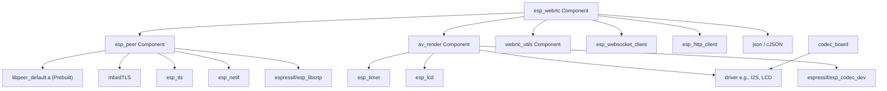
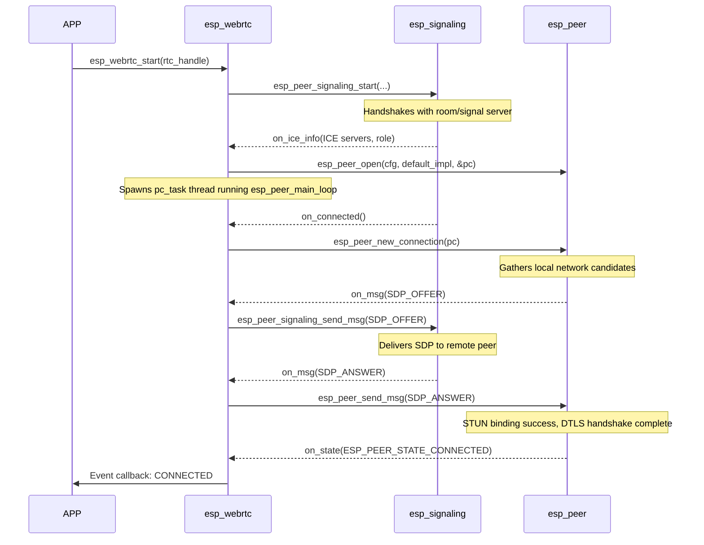

# ESP-WebRTC SDK Architecture Analysis

## 1. Executive Summary & Design Philosophy
This document provides an architectural breakdown of the Espressif WebRTC Solution SDK (`esp-webrtc-solution`). Derived from the lightweight, embedded-focused `libpeer` library, this SDK is tailored specifically for Espressif SoC targets (such as ESP32-S3 and ESP32-P4).

The SDK is structured to solve three primary requirements of real-time embedded streaming:
1. **Low-Level PeerConnection Protocol Stack (`esp_peer`)**: A solid C-based wrapper around DTLS-SRTP, ICE agent, and SCTP data channel, leveraging hardware cryptography and highly optimized networking code.
2. **Pluggable Signaling Architecture (`esp_peer_signaling`)**: An interface abstraction enabling seamless support for WebRTC signaling protocols (AppRTC WebSockets, WHIP HTTP, Janus VideoRoom, AWS KVS).
3. **High-Level Orchestration (`esp_webrtc`)**: Auto-wiring of the network/peer connection stack with the hardware capturing (`esp_capture`) and decoding/rendering pipeline (`av_render`) to hide the complexity of timing, synchronization, and audio/video coding logic.

---

## 2. Directory Structure & Organization Philosophy in `components/`
The repository separates concerns into independent ESP-IDF components inside `components/`:

```
components/
├── esp_peer/            # Low-level WebRTC PeerConnection engine (mbedTLS, Socket adapters)
│   ├── include/         # Public headers (esp_peer.h, esp_peer_types.h, esp_peer_default.h)
│   ├── libs/            # Target-specific prebuilt core engine (libpeer_default.a)
│   └── src/             # Netif adapters (UDP/TCP/TLS), DTLS-SRTP negotiation wrappers
│
├── esp_webrtc/          # High-level orchestrator & out-of-the-box signaling implementations
│   ├── include/         # Public headers (esp_webrtc.h, esp_webrtc_defaults.h)
│   ├── impl/            # Concrete signaling engines (AppRTC WS, WHIP HTTP, Janus, KVS)
│   └── src/             # Orchestrator core connecting media, signaling, and PeerConnection
│
├── av_render/           # Audio/Video rendering, resampler, and software decoder wrappers
│   ├── include/         # Playback API and frame formats (av_render.h, av_render_types.h)
│   ├── src/             # Decoding pipelines, color converters, A/V synchronization
│   └── render_impl/     # Hardware outputs (I2S driver for audio, LCD driver for video)
│
├── codec_board/         # Board support package (BSP) for Espressif audio/video dev kits
│   ├── include/         # Board codec & LCD initialization APIs (codec_board.h)
│   └── drv/             # Specific codec drivers (e.g. ES8311, ES8388)
│
├── media_lib_utils/     # Thread-safe queue and message queue utilities
└── webrtc_utils/        # Timing and basic utilities shared across components
```

### Organization Philosophy:
- **Separation of Media and Protocol**: The connection layer (`esp_peer`) has zero knowledge of how audio/video is captured or played. It deals purely with raw RTP/RTCP packets, SCTP data channels, and ICE agents.
- **Hardware Abstraction via Providers**: The orchestrator (`esp_webrtc`) receives media via a "provider" structure that points to capture/render system handles. This allows developers to swap out the underlying audio driver or camera sensor without touching the WebRTC core.
- **Prebuilt Core Protocol Engine**: To protect intellectual property, maintain version control, and minimize build times, the state machine, SDP generator, SCTP stack, and ICE agent are shipped as a prebuilt static library (`libpeer_default.a`) compiled for each target architecture (e.g., `esp32s3`, `esp32p4`).

---

## 3. Entry Points & Main Header Files
The SDK exposes its capabilities through a hierarchical set of entry point headers:

1. **`esp_webrtc.h`** (Orchestration Engine):
   - The primary entry point for application developers. Provides high-level control (`esp_webrtc_start()`, `esp_webrtc_stop()`, `esp_webrtc_set_media_provider()`) and handles events (`esp_webrtc_event_t`).
2. **`esp_webrtc_defaults.h`**:
   - Helper header to obtain references to the default PeerConnection engine and specific signaling clients (AppRTC, WHIP, Janus, KVS).
3. **`esp_peer.h` & `esp_peer_types.h`**:
   - The low-level interface to the ICE/SDP agent. Used directly when developers want custom signaling/media orchestration but still need the WebRTC transport protocol stack.
4. **`esp_peer_signaling.h`**:
   - The contract header for pluggable signaling engines. Defines standard message callbacks (`on_ice_info`, `on_msg`, `on_connected`).
5. **`av_render.h` & `av_render_types.h`**:
   - Entry point to control audio/video decoding (H264, MJPEG, OPUS, G.711) and hardware outputs (I2S, LCD).

---

## 4. Core Abstractions & Struct Definitions

### A. Peer Connection Abstraction (`esp_peer.h`)
Handles the low-level P2P link. The application configures callbacks to receive media and data.

```c
typedef struct {
    esp_peer_ice_server_cfg_t   *server_lists;        // STUN/Relay server list
    uint8_t                      server_num;          // Number of ICE servers
    esp_peer_role_t              role;                // Controlling vs Controlled
    esp_peer_ice_trans_policy_t  ice_trans_policy;    // All vs Relay-only
    esp_peer_audio_stream_info_t audio_info;          // Send audio parameters (OPUS, G711)
    esp_peer_video_stream_info_t video_info;          // Send video parameters (H264, MJPEG)
    
    // Core Callback Hooks
    int (*on_state)(esp_peer_state_t state, void* ctx);
    int (*on_msg)(esp_peer_msg_t* info, void* ctx);         // Emits Local SDP / Candidates
    int (*on_video_data)(esp_peer_video_frame_t* frame, void* ctx); // Incoming raw video payload
    int (*on_audio_data)(esp_peer_audio_frame_t* frame, void* ctx); // Incoming raw audio payload
    int (*on_data)(esp_peer_data_frame_t *frame, void *ctx);        // Incoming SCTP data channel payload
} esp_peer_cfg_t;

typedef struct {
    int (*open)(esp_peer_cfg_t* cfg, esp_peer_handle_t* peer);
    int (*new_connection)(esp_peer_handle_t peer);
    int (*send_msg)(esp_peer_handle_t peer, esp_peer_msg_t* msg);   // Ingests Remote SDP / Candidates
    int (*send_video)(esp_peer_handle_t peer, esp_peer_video_frame_t* frame);
    int (*send_audio)(esp_peer_handle_t peer, esp_peer_audio_frame_t* frame);
    int (*send_data)(esp_peer_handle_t peer, esp_peer_data_frame_t* frame);
    int (*main_loop)(esp_peer_handle_t peer);                       // Periodic tick loop (e.g., 20ms)
    int (*close)(esp_peer_handle_t peer);
} esp_peer_ops_t;
```

### B. Signaling Abstraction (`esp_peer_signaling.h`)
Pluggable adapter interface to talk to various signaling servers.

```c
typedef struct {
    esp_peer_signaling_msg_type_t type;  // SDP, CANDIDATE, BYE, CUSTOMIZED
    uint8_t                      *data;
    int                           size;
} esp_peer_signaling_msg_t;

typedef struct {
    int (*start)(esp_peer_signaling_cfg_t* cfg, esp_peer_signaling_handle_t* sig);
    int (*send_msg)(esp_peer_signaling_handle_t sig, esp_peer_signaling_msg_t* msg);
    int (*stop)(esp_peer_signaling_handle_t sig);
} esp_peer_signaling_impl_t;
```

### C. Media Provider & High-level Orchestration (`esp_webrtc.h`)
Binds media capture/render to the WebRTC event lifecycle.

```c
typedef struct {
    esp_capture_handle_t capture; // High-level hardware media recorder handle
    av_render_handle_t   player;  // High-level render/decode engine handle
} esp_webrtc_media_provider_t;

typedef struct {
    const esp_peer_signaling_impl_t *signaling_impl; // e.g. esp_signaling_get_apprtc_impl()
    esp_webrtc_signaling_cfg_t       signaling_cfg;  // URL, credentials, token
    const esp_peer_ops_t            *peer_impl;      // e.g. esp_peer_get_default_impl()
    esp_webrtc_peer_cfg_t            peer_cfg;       // Audio/Video config, callbacks
} esp_webrtc_cfg_t;
```

---

## 5. Compile Structure & Core Dependencies

### A. Dependencies Graph



### B. Component Compilation Details
- **`esp_peer` Build (`CMakeLists.txt`)**:
  - Dynamically switches sources based on the IDF version. For ESP-IDF v6.0+ it compiles `src/dtls_srtp_v6.c`, otherwise `src/dtls_srtp.c` to maintain compatibility with changes in mbedTLS APIs.
  - Sockets and raw packets are processed in custom C files: `transport/udp.c` (ICE gathering and packet dispatch), `transport/tcp.c` (TCP ICE candidates support), and `transport/peer_tls_esp.c` (TURN over TLS).
  - Explicitly registers a prebuilt library via:
    ```cmake
    add_prebuilt_library(${BASE_DIR} "${CMAKE_CURRENT_SOURCE_DIR}/libs/${IDF_TARGET}/libpeer_default.a"
                         PRIV_REQUIRES ${BASE_DIR} esp_timer)
    ```
- **`av_render` Build**:
  - Integrates direct assembly-optimized color conversion libraries (`libesp_image_i420_2_rgb565le.a`) when compiling for the high-performance `esp32p4` target to ensure smooth video rendering onto local displays.

---

## 6. End-to-End Sequence & Data Flow

### A. Connection Handshake Sequence
The typical startup flow coordinates the signaling connection and SDP negotiation to establish the WebRTC channel:



### B. Media Processing Flow
Once connected, the capture and rendering tasks execute concurrently:

1. **Outgoing Pipeline (Capture & Send)**:
   - `pc_send` thread wakes up periodically (every 20ms).
   - Audio/Video frames are acquired from `esp_capture` via a thread-safe sink.
   - For audio, raw samples are passed directly to `esp_peer_send_audio` (which encodes if needed and sends RTP).
   - For video, `on_video_send` hook is triggered (permits SEI/metadata injection), then frame is sent via SRTP (`esp_peer_send_video`) or Data Channel.
   - Frames are released back to the capture pool.

2. **Incoming Pipeline (Receive & Playback)**:
   - `pc_task` loop (`esp_peer_main_loop`) receives network packets, decodes SRTP, and reorders packets inside a Jitter Buffer.
   - Triggers `on_audio_data` or `on_video_data` callbacks.
   - Frames are added to `av_render` via `av_render_add_audio_data` / `av_render_add_video_data` queues.
   - Separate decoder threads decode audio (OPUS/G.711) and video (H.264/MJPEG).
   - A/V Synchronization:
     - Synchronization runs under mode `AV_RENDER_SYNC_FOLLOW_AUDIO` or `AV_RENDER_SYNC_FOLLOW_TIME`.
     - Output render tasks feed decoded audio to I2S DMA buffers, and paint decoded video onto the LCD using `esp_lcd` APIs, dropping frames if decode/rendering lags.
