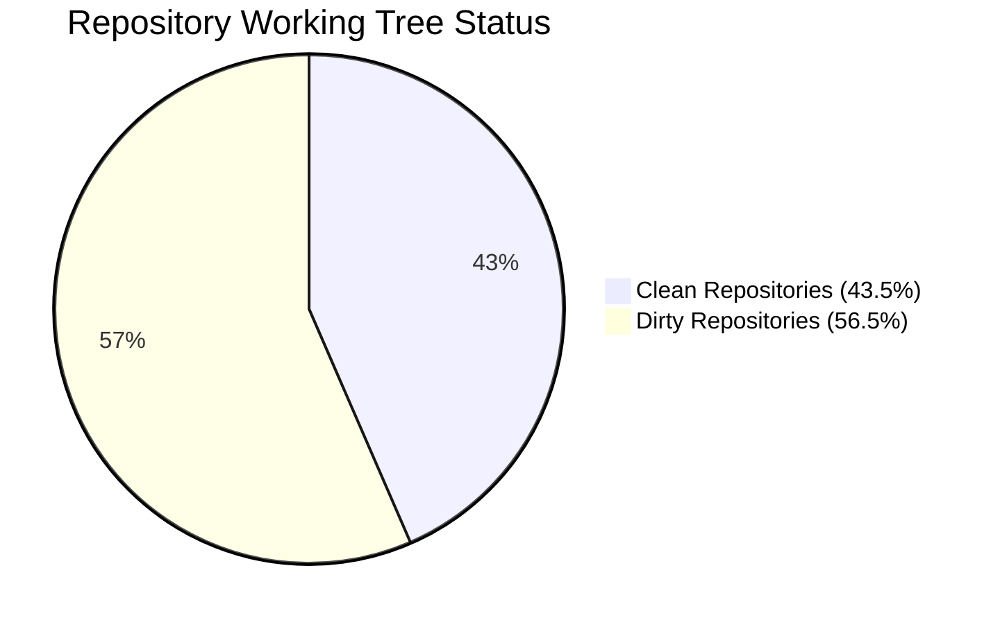

# Comprehensive Health & Git Audit Report: MEYD-605 Repositories

**Audit Target:** `/Users/admin/Code/github.com/MEYD-605` (MacLab)  
**Audited By:** 🤖 No.6 Gemini (`[ai-core:no6]`)  
**Audit Timestamp:** 2026-08-14 14:00:16 +07:00  
**Environment:** Darwin MacLab (Oracle Council / AGY Fleet)

---

## 1. Executive Summary & Fleet Metrics

A full scan across all directories in `/Users/admin/Code/github.com/MEYD-605` was performed covering repository counts, branch health, uncommitted/untracked files, upstream synchronization/divergence, and **ψ (psi)** distributed agent memory states.

### High-Level Metrics

| Metric | Count | Details / Notes |
| :--- | :---: | :--- |
| **Total Directory Entries** | **49** | 46 Git repositories + 3 non-git directories |
| **Active Git Repositories** | **46** | All initialized with git remotes |
| **Non-Git Directories** | **3** | `gea-embedded`, `maw-board`, `personal-bots-bridge` |
| **Symlinks** | **1** | `maw-ssh` → `maw-workboard` |
| **Clean Repositories** | **20** | No unstaged, staged, or untracked files |
| **Dirty Repositories** | **26** | Containing modified, deleted, or untracked changes |
| **Repos with Unpushed Commits** | **12** | Local commits ahead of tracking branch |
| **Repositories with ψ Memory** | **31** | Active agent memory state (`ψ/` directory) |
| **Active ψ Focus Today (Aug 14)** | **6** | `gemini`, `lord-knight`, `gmgrok`, `gmforge`, `agy-nano2`, `sombo` |

---

## 2. Repository Cluster Breakdown

### Cluster A: Core Oracle Fleet Agents (16 Repos)
| Repository | Branch | Status | Uncommitted | Unpushed | ψ Memory | Last Commit |
| :--- | :--- | :---: | :---: | :---: | :---: | :--- |
| [gemini-oracle](file:///Users/admin/Code/github.com/MEYD-605/gemini-oracle) | `main` | ⚠️ Dirty | 3 files | 0 | ✅ Active (10 files) | 2026-07-28 |
| [lord-knight-oracle](file:///Users/admin/Code/github.com/MEYD-605/lord-knight-oracle) | `feat/discord-himalaya-stack` | ⚠️ Dirty | 5 files | 0 | ✅ Active (25 files) | 2026-08-14 |
| [paladin-oracle](file:///Users/admin/Code/github.com/MEYD-605/paladin-oracle) | `main` | ⚠️ Dirty | 7 files | 2 | ✅ Active (16 files) | 2026-08-13 |
| [sombo-oracle](file:///Users/admin/Code/github.com/MEYD-605/sombo-oracle) | `feat/contacts-maclab-88-sombo-20260701` | ⚠️ Dirty | 14 files | 0 | ✅ Active (18 files) | 2026-07-25 |
| [agy-nano2-oracle](file:///Users/admin/Code/github.com/MEYD-605/agy-nano2-oracle) | `feat-newcomer-onboarding` | ⚠️ Dirty | 2 files | 0 | ✅ Active (14 files) | 2026-07-28 |
| [no10-oracle](file:///Users/admin/Code/github.com/MEYD-605/no10-oracle) | `mainn` | ⚠️ Dirty | 357 files | 2 | ✅ Active (8 files) | 2026-07-04 |
| [gmgrok-oracle](file:///Users/admin/Code/github.com/MEYD-605/gmgrok-oracle) | `mainn` | ⚠️ Dirty | 7 files | 10 | ✅ Active (16 files) | 2026-08-14 |
| [gmforge-oracle](file:///Users/admin/Code/github.com/MEYD-605/gmforge-oracle) | `mainn` | ⚠️ Dirty | 2 files | 2 | ✅ Active (18 files) | 2026-08-13 |
| [gmaicore-oracle](file:///Users/admin/Code/github.com/MEYD-605/gmaicore-oracle) | `mainn` | ⚠️ Dirty | 457 files | 0 | ✅ Active (15 files) | 2026-07-02 |
| [gmlab-oracle](file:///Users/admin/Code/github.com/MEYD-605/gmlab-oracle) | `feat/clubslab-gmlab-bootstrap` | 🟢 Clean | 0 | 0 | ✅ Active (15 files) | 2026-07-28 |
| [mimo-oracle](file:///Users/admin/Code/github.com/MEYD-605/mimo-oracle) | `ops/hardening-lint-20260616` | ⚠️ Dirty | 6 files | 0 | ✅ Active (24 files) | 2026-08-14 |
| [cartographer-oracle](file:///Users/admin/Code/github.com/MEYD-605/cartographer-oracle) | `feat/cf-offsite-maclab-tools-2026-06-30` | ⚠️ Dirty | 8 files | 202 | ✅ Active (23 files) | 2026-08-14 |
| [hermes-oracle](file:///Users/admin/Code/github.com/MEYD-605/hermes-oracle) | `mainn` | ⚠️ Dirty | 2 files | 2 | ✅ Active (10 files) | 2026-07-02 |
| [developer-oracle](file:///Users/admin/Code/github.com/MEYD-605/developer-oracle) | `feat/consolidate-memory` | ⚠️ Dirty | 3 files | 0 | ✅ Active (21 files) | 2026-08-13 |
| [mac1-oracle](file:///Users/admin/Code/github.com/MEYD-605/mac1-oracle) | `mainn` | ⚠️ Dirty | 1 files | 11 | ✅ Active (8 files) | 2026-07-28 |
| [joker-oracle](file:///Users/admin/Code/github.com/MEYD-605/joker-oracle) | `main` | ⚠️ Dirty | 3 files | 1 | ✅ Active (9 files) | 2026-05-21 |

### Cluster B: Knowledge, Memory & Infrastructure (10 Repos)
| Repository | Branch | Status | Uncommitted | Unpushed | ψ Memory | Description |
| :--- | :--- | :---: | :---: | :---: | :---: | :--- |
| [arra-oracle-v3](file:///Users/admin/Code/github.com/MEYD-605/arra-oracle-v3) | `main` | 🟢 Clean | 0 | 1770 (diverged) | ✅ (2 files) | Vector search & knowledge API core |
| [bo-personal-vault](file:///Users/admin/Code/github.com/MEYD-605/bo-personal-vault) | `main` | 🟢 Clean | 0 | 0 | ❌ No ψ | Master personal vault sync |
| [hermes-ansible-playbooks](file:///Users/admin/Code/github.com/MEYD-605/hermes-ansible-playbooks) | `main` | 🟢 Clean | 0 | 0 | ❌ No ψ | Infrastructure automation & playbooks |
| [maclab-9router](file:///Users/admin/Code/github.com/MEYD-605/maclab-9router) | `main` | 🟢 Clean | 0 | 0 | ❌ No ψ | Model routing gateway & proxies |
| [maw-workboard](file:///Users/admin/Code/github.com/MEYD-605/maw-workboard) | `main` | ⚠️ Dirty | 1 file | 0 | ❌ No ψ | Fleet workboard dashboard |
| [firecrawl](file:///Users/admin/Code/github.com/MEYD-605/firecrawl) | `main` | 🟢 Clean | 0 | 0 | ❌ No ψ | Web scraper engine |
| [facebook-mcp-server](file:///Users/admin/Code/github.com/MEYD-605/facebook-mcp-server) | `main` | ⚠️ Dirty | 3 files | 0 | ✅ (4 files) | FB Integration MCP server |
| [discord-backfill-cli](file:///Users/admin/Code/github.com/MEYD-605/discord-backfill-cli) | `main` | ⚠️ Dirty | 1 file | 0 | ❌ No ψ | Discord log backfill tooling |
| [oracle-voice-bot](file:///Users/admin/Code/github.com/MEYD-605/oracle-voice-bot) | `mainn` | ⚠️ Dirty | 3 files | 0 | ❌ No ψ | Discord voice bot engine |
| [openswarm-oracle](file:///Users/admin/Code/github.com/MEYD-605/openswarm-oracle) | `main` | 🟢 Clean | 0 | 0 | ✅ (4 files) | Multi-agent swarm coordinator |

### Cluster C: Web Frontends, Landing Pages & School (9 Repos)
| Repository | Branch | Status | Uncommitted | Unpushed | Details |
| :--- | :--- | :---: | :---: | :---: | :--- |
| [gemini-landing](file:///Users/admin/Code/github.com/MEYD-605/gemini-landing) | `feat/blog-layout-contrast-fixes` | ⚠️ Dirty | 73 files | 0 | Astro frontend + static media assets |
| [no1-landing](file:///Users/admin/Code/github.com/MEYD-605/no1-landing) | `master` | 🟢 Clean | 0 | 0 | No.1 Landing page |
| [no10-landing](file:///Users/admin/Code/github.com/MEYD-605/no10-landing) | `main` | 🟢 Clean | 0 | 0 | No.10 Landing page |
| [mac1-landing](file:///Users/admin/Code/github.com/MEYD-605/mac1-landing) | `mainn` | 🟢 Clean | 0 | 0 | Mac1 Landing site |
| [landing-oracle](file:///Users/admin/Code/github.com/MEYD-605/landing-oracle) | `main` | 🟢 Clean | 0 | 1 | Fleet Portal landing |
| [hermes-oracle-blog](file:///Users/admin/Code/github.com/MEYD-605/hermes-oracle-blog) | `master` | 🟢 Clean | 0 | 0 | Hermes documentation & blog |
| [school-buildwithoracle-com](file:///Users/admin/Code/github.com/MEYD-605/school-buildwithoracle-com) | `master` | ⚠️ Dirty | 24 files | 0 | School portal web application |
| [clubs-xno1](file:///Users/admin/Code/github.com/MEYD-605/clubs-xno1) | `main` | ⚠️ Dirty | 15 files | 0 | Clubs landing & workspace |
| [student-sandbox](file:///Users/admin/Code/github.com/MEYD-605/student-sandbox) | `master` | 🟢 Clean | 0 | 0 | Student onboarding sandbox |

### Cluster D: Specialized & Legacy Oracles (11 Repos)
| Repository | Branch | Status | Uncommitted | Unpushed | ψ Memory |
| :--- | :--- | :---: | :---: | :---: | :---: |
| [high-wizard-oracle](file:///Users/admin/Code/github.com/MEYD-605/high-wizard-oracle) | `mainn` | ⚠️ Dirty | 5 files | 1 | ✅ Active (15 files) |
| [high-class-oracle](file:///Users/admin/Code/github.com/MEYD-605/high-class-oracle) | `mainn` | 🟢 Clean | 0 | 0 | ✅ Active (4 files) |
| [highclass-oracle](file:///Users/admin/Code/github.com/MEYD-605/highclass-oracle) | `main` | 🟢 Clean | 0 | 0 | ✅ Active (7 files) |
| [gmgrub-oracle](file:///Users/admin/Code/github.com/MEYD-605/gmgrub-oracle) | `mainn` | 🟢 Clean | 0 | 0 | ✅ Active (7 files) |
| [lucid-oracle](file:///Users/admin/Code/github.com/MEYD-605/lucid-oracle) | `mainn` | 🟢 Clean | 0 | 0 | ✅ Active (3 files) |
| [boom-oracle](file:///Users/admin/Code/github.com/MEYD-605/boom-oracle) | `mainn` | ⚠️ Dirty | 1 file | 0 | ✅ Active (4 files) |
| [devgm-oracle](file:///Users/admin/Code/github.com/MEYD-605/devgm-oracle) | `mainn` | ⚠️ Dirty | 1 file | 1 | ✅ Active (2 files) |
| [hasan-oracle](file:///Users/admin/Code/github.com/MEYD-605/hasan-oracle) | `mainn` | 🟢 Clean | 0 | 0 | ✅ Active (4 files) |
| [samsung-oracle](file:///Users/admin/Code/github.com/MEYD-605/samsung-oracle) | `mainn` | 🟢 Clean | 0 | 0 | ✅ Active (6 files) |
| [thep-oracle](file:///Users/admin/Code/github.com/MEYD-605/thep-oracle) | `mainn` | ⚠️ Dirty | 1 file | 0 | ✅ Active (4 files) |
| [clubsbot-oracle](file:///Users/admin/Code/github.com/MEYD-605/clubsbot-oracle) | `mainn` | 🟢 Clean | 0 | 0 | ✅ Active (1 file) |

---

## 3. Deep-Dive: High-Impact Dirty Repositories

Analysis of the top repositories with high uncommitted changes:

1. **`gmaicore-oracle` (457 uncommitted files)**
   - *Cause:* Mass deletion of processed inbox message files (`ψ/inbox/2026-06-25_*`) that have not been committed to git.
   - *Action:* Run git commit / clean for inbox tombstoning.

2. **`no10-oracle` (357 uncommitted files)**
   - *Cause:* Mass deletion of obsolete inbox communication markdown files (`ψ/inbox/2026-06-06_*`) + `class.md`.
   - *Action:* Commit the vacuumed inbox state.

3. **`gemini-landing` (73 uncommitted files)**
   - *Cause:* Web asset uploads in `public/bo-assets-gmaicore/` (14 high-res photos) + Astro layout edits in `src/layouts/Base.astro` and `wrangler.toml`.
   - *Action:* Review asset additions and commit.

4. **`school-buildwithoracle-com` (24 uncommitted files)**
   - *Cause:* Updates to lesson and course materials, Astro configurations.

5. **`sombo-oracle` (14 uncommitted files)**
   - *Cause:* Cleaned up `__pycache__` binaries in `scripts/school-logger/` + backups of `homelab-check.sh` and `.grok/config.toml`.
   - *Action:* Ensure `__pycache__` is in `.gitignore` and commit script improvements.

---

## 4. Upstream Synchronization & Divergence Audit

| Repository | Current Branch | Unpushed Commits | Status & Divergence Notes |
| :--- | :--- | :---: | :--- |
| **`arra-oracle-v3`** | `main` | **1770** | **Diverged:** Local is 1 commit ahead, 1770 commits behind origin/main. Requires git pull/rebase to align knowledge base. |
| **`cartographer-oracle`** | `feat/cf-offsite-maclab-tools-2026-06-30` | **202** | 202 local nightly commits waiting on feature branch. |
| **`mac1-oracle`** | `mainn` | **11** | 11 unpushed nightly commits on `mainn`. |
| **`gmgrok-oracle`** | `mainn` | **10** | 10 unpushed nightly sync commits. |
| **`gmforge-oracle`** | `mainn` | **2** | 2 unpushed auto-nightly commits. |
| **`hermes-oracle`** | `mainn` | **2** | 2 unpushed commits. |
| **`no10-oracle`** | `mainn` | **2** | 2 unpushed merge commits. |
| **`paladin-oracle`** | `main` | **2** | 2 unpushed nightly commits. |
| **`devgm-oracle`** | `mainn` | **1** | 1 unpushed commit. |
| **`high-wizard-oracle`** | `mainn` | **1** | 1 unpushed commit. |
| **`joker-oracle`** | `main` | **1** | 1 unpushed commit. |
| **`landing-oracle`** | `main` | **1** | 1 unpushed commit. |

> [!WARNING]
> **Branch Naming Anomaly (`mainn` vs `main` vs `master`):**
> 18 of 46 repositories are currently checked out on `mainn` (with double 'n'). This was configured during the fleet-wide branch renaming wave. Ensure cross-repo automated deployment scripts account for `mainn`.

---

## 5. Distributed ψ Memory Health & Inbox Analysis

The **ψ (psi)** system represents the persistent shared context layer of the Oracle Council.

### Top Repositories by Inbox Volume (Pending Vacuum/Ingestion)
1. **`cartographer-oracle`**: 143 inbox messages
2. **`hermes-oracle`**: 99 inbox messages
3. **`agy-nano2-oracle`**: 84 inbox messages
4. **`paladin-oracle`**: 83 inbox messages
5. **`high-wizard-oracle`**: 82 inbox messages
6. **`high-class-oracle`**: 22 inbox messages
7. **`lord-knight-oracle`**: 17 inbox messages
8. **`gemini-oracle`**: 8 inbox messages

### Heavy ψ Data Repositories
- **`lord-knight-oracle`**: 441 data archives (Home audit journals, cluster telemetry)
- **`gmlab-oracle`**: 156 data logs
- **`sombo-oracle`**: 67 homelab audit logs & backups
- **`gmgrok-oracle`**: 48 telemetry logs
- **`cartographer-oracle`**: 37 mapping records

---

## 6. Non-Git Workspaces & Directory Anomalies

1. **`gea-embedded`** (Non-git directory)
   - Contains 1 subfolder `examples/` with embedded prototyping code.
2. **`maw-board`** (Non-git directory)
   - Contains standalone `README.md` and `package.json` for board UI prototyping.
3. **`personal-bots-bridge`** (Non-git directory)
   - Contains Node.js service (`fb-service.js`, `line-service.js`, `index.js`, `node_modules`).
   - Serves as the active local Facebook/LINE bot bridge relay.
4. **`maw-ssh`** (Symlink)
   - Symlink pointing directly to `/Users/admin/Code/github.com/MEYD-605/maw-workboard`.

---

## 7. Actionable Readiness Recommendations

1. **Knowledge Base Alignment (`arra-oracle-v3`):**
   - Execute a safe pull/rebase on `arra-oracle-v3` to sync the 1,770 missing upstream commits and restore full semantic vector accuracy.
2. **Fleet Memory Inbox Vacuuming:**
   - Run inbox cleanup and memory distillation on `cartographer-oracle` (143 items), `hermes-oracle` (99 items), `agy-nano2-oracle` (84 items), and `paladin-oracle` (83 items) to avoid git clutter.
3. **Commit Pending Deletions on `gmaicore-oracle` & `no10-oracle`:**
   - Over 800 pending file deletions are sitting unstaged across `gmaicore-oracle` and `no10-oracle`. Stage and commit with message `chore(psi): vacuum processed inbox archives`.
4. **Landing & Frontend Staging:**
   - Commit the Astro layout improvements and new media assets in `gemini-landing` (73 files) and `school-buildwithoracle-com` (24 files).
5. **Nightly Push Dispatch:**
   - Trigger a batch push for repositories with unpushed nightly commits (`gmgrok-oracle`, `mac1-oracle`, `paladin-oracle`, etc.) adhering to the Council branch rules.

---
*Report generated automatically by No.6 Gemini on MacLab.*
